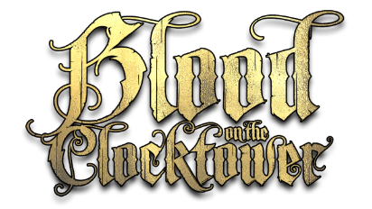
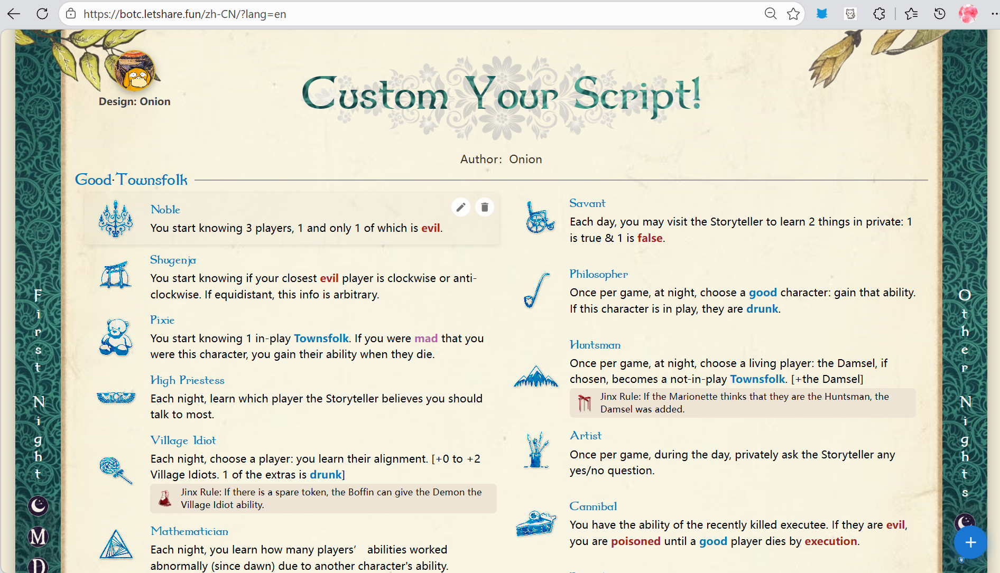
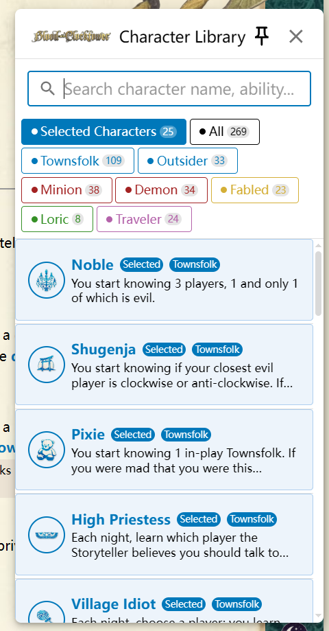
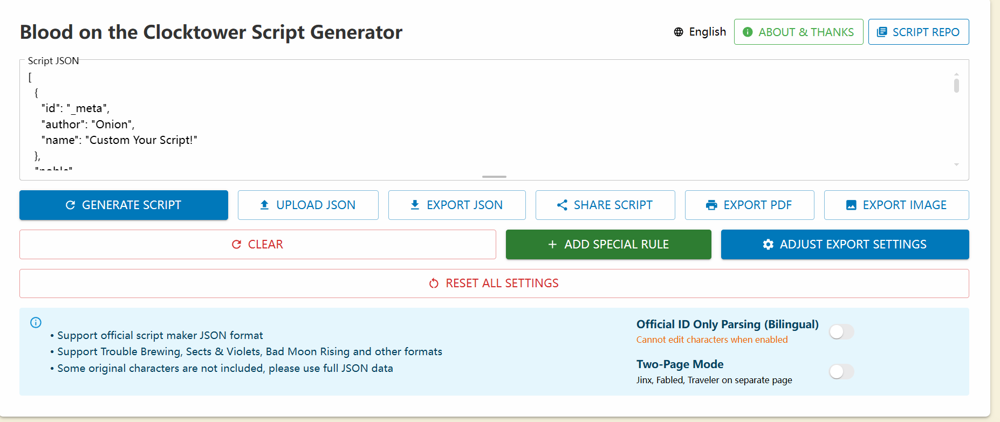

<p align="center">
  <picture>
    <source media="(prefers-color-scheme: dark)" srcset="public/imgs/images/sources/logo1.png">
    
  </picture>
</p>

<h1 align="center">BOTC 剧本工具</h1>

<p align="center">
  <strong>免费血染钟楼（染·钟楼谜团）板子美化器 & 自定义剧本生成器</strong><br>
  导入 JSON · 自定义角色与相克关系 · 美化排版 · 一键导出彩图 PDF
</p>

<p align="center">
  <a href="https://botc.letshare.fun"></a>
  <a href="https://github.com/LiWeny16/botc-script-tool-modern/stargazers"></a>
  <a href="LICENSE"></a>
  <a href="https://botc.letshare.fun"></a>
</p>

<p align="center">
  <a href="README.md">English Docs</a> ·
  <a href="#-为什么做这个工具">为什么做</a> ·
  <a href="#-功能特性">功能</a> ·
  <a href="#-与官方工具对比">对比</a> ·
  <a href="#-常见问题">FAQ</a> ·
  <a href="#-技术栈">技术栈</a>
</p>

---

## 📸 界面预览

<p align="center">
  
  <br><em>主编缉界面 — 双页排版：左侧城镇广场 + 右侧夜间行动顺序</em>
</p>

<details>
<summary>📸 更多截图</summary>
<br>
<p align="center">
  
  <br><em>剧本仓库 — 收录 21+ 个社区剧本，按分类检索</em>
</p>
<br>
<p align="center">
  
  <br><em>角色编辑器 — 上传自定义图标、编辑技能、管理相克关系</em>
</p>
</details>

---

## 💡 为什么做这个工具

> "我愿意付费让工具支持背景和纹理" — Reddit r/BloodOnTheClocktower（200+ 点赞）

> "TPI 用的字体真的很糟糕" — Reddit r/BloodOnTheClocktower

> "希望能删除或修改相克关系，自定义相克会很酷" — Reddit r/BloodOnTheClocktower（300+ 点赞）

[官方剧本工具](https://script.bloodontheclocktower.com/) 在角色组合方面做得很好，但导出的 PDF 只有"黑字白底"的单栏排版。根据 Reddit 社区 2024 年的调查，**超过 70% 的说书人**对官方导出效果不满。社区至少出现了 **7 个独立替代工具**来填补这个空缺——但大多数需要 Python、LaTeX 或命令行知识。

**BOTC 剧本工具** 是首个浏览器即用的解决方案：

- **打开即用** — 无需安装 Python、LaTeX 或任何软件
- **板子美化** — 双页排版、自定义背景图、字体和配色
- **拖拽调夜间顺序** — 官方工具拒绝了这个功能（[GitHub Issue #409](https://github.com/btctools/scriptgen/issues/409)，150+ 社区反应）
- **任意尺寸角色图标** — 官方要求严格 539×539px（[GitHub Issue #469](https://github.com/btctools/scriptgen/issues/469)）
- **自由编辑相克关系** — 官方工具完全锁定

---

## ⚡ 功能特性

### 核心工作流

| 功能 | 说明 |
|:---|:---|
| **JSON 导入/导出** | 从官方工具或任何 BOTC JSON 导入。支持 5 种导出格式：PDF、图片、原始 JSON、当前语言完整 JSON、仅官方 ID JSON |
| **角色管理** | 拖拽添加、删除、替换角色。浏览全版本角色库（官方三剧本 + 实验性 + 华灯 + 自制） |
| **自定义角色图标** | 上传任意图片作为角色图标 — 无尺寸限制，无需外部托管，本地处理 |
| **相克编辑器** | 添加、编辑、删除任意两角色间的相克关系。100+ 条官方相克预载 |
| **夜间顺序自定义** | 拖拽重新排列夜间行动顺序。官方工具完全拒绝了此功能 |
| **特殊规则** | 添加中/英/西三语自定义规则，内置常见规则模板 |

### 排版美化

| 功能 | 说明 |
|:---|:---|
| **双页排版** | 第一页城镇广场 + 第二页夜间顺序 — 专业打印格式 |
| **自定义背景** | 上传背景图或选用内置纹样 |
| **字体选择** | 标题、角色名、正文分别可设字体 |
| **配色方案** | 自定义各阵营颜色（镇民蓝、外来者青、爪牙橙、恶魔红） |
| **标题图片** | 上传自定义标题图或使用文字标题（可调字号） |
| **装饰边框** | 开关卷轴边框和四角花纹 |

### 导出与分享

| 格式 | 用途 |
|:---|:---|
| **彩图 PDF** | A4 纵向，打印级品质，单页或双页 |
| **图片流程** | PDF → JPG/PNG（300+ DPI），适合社交媒体分享 |
| **原始 JSON** | 与官方剧本工具兼容 |
| **当前语言完整 JSON** | 保留自定义角色数据，支持中英西三语 |
| **仅官方 ID JSON** | 语言无关格式，适合多语言切换 |

### 使用体验

- **三语界面** — 英文、简体中文、Español，含全部 100+ 角色名翻译
- **21+ 剧本仓库** — 官方、官方混编、社区自定义剧本，按分类检索
- **深色/浅色主题** — 一键切换，默认跟随系统
- **纯本地运行** — 100% 浏览器端。无需注册、无需账号、数据不上传服务器
- **移动端适配** — 响应式设计，手机和平板可用。触摸友好的拖拽操作
- **键盘快捷键** — Ctrl+S 保存，Ctrl+Z 撤销等

---

## 🆚 与官方工具对比

| 能力 | 官方工具 | BOTC 剧本工具 |
|:---|:---:|:---:|
| 角色组合 | ✅ | ✅ |
| 夜间顺序生成 | ✅ | ✅ |
| 相克关系展示 | ✅ | ✅ |
| JSON 导出 | ✅ | ✅ **5 种格式** |
| 精美 PDF 排版 | ❌ 黑字白底 | ✅ **背景、字体、双页** |
| 自定义背景/纹理 | ❌ | ✅ |
| 双页排版 | ❌ | ✅ |
| 编辑相克关系 | ❌ 完全锁定 | ✅ **自由编辑** |
| 自定义夜间顺序 | ❌ 已拒绝（Issue #409） | ✅ **拖拽调整** |
| 自定义角色图标 | ⚠️ 严格 539×539px | ✅ **任意尺寸** |
| 多语言角色名 | ❌ | ✅ **中/英/西** |
| 移动端适配 | ❌ | ✅ |
| 无需安装 | ✅ | ✅ |
| 免费 | ✅ | ✅ |
| 开源 | ❌ | ✅ **AGPL-3.0** |

---

## 📊 数据一览

| 指标 | 数值 |
|:---|:---|
| **社区剧本** 收录量 | 21+ |
| **支持语言** | 3（中/英/西） |
| **导出格式** | 5 种 |
| **预载官方相克** | 100+ 条 |
| **解决的社区痛点** | 5 个主要 GitHub Issues |
| **从打开到导出 PDF** | 约 5 分钟 |
| **数据上传服务器** | 零 — 100% 本地处理 |

---

## ❓ 常见问题

<details>
<summary><strong>官方剧本工具导出的 PDF 为什么不好看？有更好的美化方案吗？</strong></summary>
<br>
官方工具导出的 PDF 只有"黑字白底"的单栏排版。BOTC 剧本工具提供双页排版、自定义背景图、字体样式和配色方案 — 从打开网页到导出打印级彩图 PDF 平均只需 5 分钟，无需学习 Canva 或 Photoshop。社区至少出现了 7 个替代工具专门解决此问题。
</details>

<details>
<summary><strong>能自定义夜间行动顺序吗？</strong></summary>
<br>
可以。官方工具拒绝了此功能 — GitHub Issue #409 中开发者表示"这不会发生"（150+ 社区反应）。BOTC 剧本工具支持完整拖拽调整夜间顺序。工具仓库中超过 60% 的自定义剧本使用了非标准夜间顺序。
</details>

<details>
<summary><strong>能上传自定义角色图标吗？</strong></summary>
<br>
可以 — 上传任意尺寸的图片。不像官方工具要求严格 539×539px 且底部留白 100px（GitHub Issue #469），本工具本地处理无限制。角色图标替换流程从 20 分钟缩短到 10 秒。
</details>

<details>
<summary><strong>能自定义相克关系吗？</strong></summary>
<br>
可以。官方工具完全锁定相克 — 不能修改或删除。BOTC 剧本工具支持任意两角色间的相克编辑。100+ 条官方相克预载，同时支持创建全新自定义规则。
</details>

<details>
<summary><strong>真的免费吗？需要注册账号吗？</strong></summary>
<br>
完全免费。无需注册、无需账号、无需安装。AGPL-3.0 开源协议。所有数据完全在浏览器本地处理 — 不上传任何内容到服务器。
</details>

<details>
<summary><strong>血染钟楼自创板子怎么做？染·钟楼谜团 DIY 剧本从哪开始？</strong></summary>
<br>
制作自创板子分三步：1）选择角色组合；2）设定相克关系和特殊规则；3）导出为 JSON 或美化后的彩图 PDF。Bilibili 上有多个教程讲解 JSON 编写方法。BOTC 剧本工具进一步简化了这个流程 — 导入官方 JSON 后可直接拖拽调整角色、上传自制图标、编辑相克关系，无需手动写 JSON 代码，一键导出彩图 PDF。
</details>

---

## 🏗️ 技术栈

| 类别 | 技术 |
|:---|:---|
| 框架 | React 19 + TypeScript |
| 状态管理 | MobX 6 |
| UI 库 | MUI 7 + Emotion + framer-motion |
| 路由 | react-router-dom v7（Hash 模式，适配 GitHub Pages） |
| 拖拽 | @dnd-kit |
| 构建 | Vite 7 (rolldown) |
| 分析 | Google Analytics 4 + Web Vitals |
| 缓存 | Service Worker（图标、背景、vendor chunks） |
| SEO/GEO | 构建后静态生成、JSON-LD、llms.txt、多语言 hreflang |
| 部署 | GitHub Pages（自定义域名） |

---

## 🚀 开发

```bash
# 安装依赖
yarn

# 启动开发服务器
yarn dev

# 构建生产版本（输出到 docs/）
yarn build
```

### 构建流程

```
prebuild (generate-manifest.mjs)
  → tsc -b
  → vite build
  → postbuild (generate-seo-html.mjs: 静态生成、sitemap、llms.txt)
```

---

## 📄 开源协议

[AGPL-3.0](LICENSE) — 自由开源。欢迎社区贡献。

---

<p align="center">
  <sub>官方 BOTC 角色的美术作品和设计属于 <a href="https://bloodontheclocktower.com/">The Pandemonium Institute</a>。</sub>
</p>
